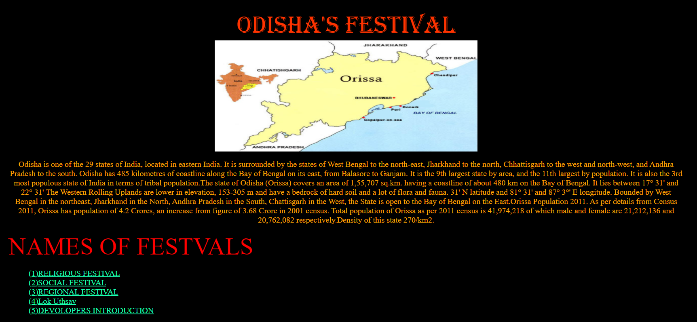
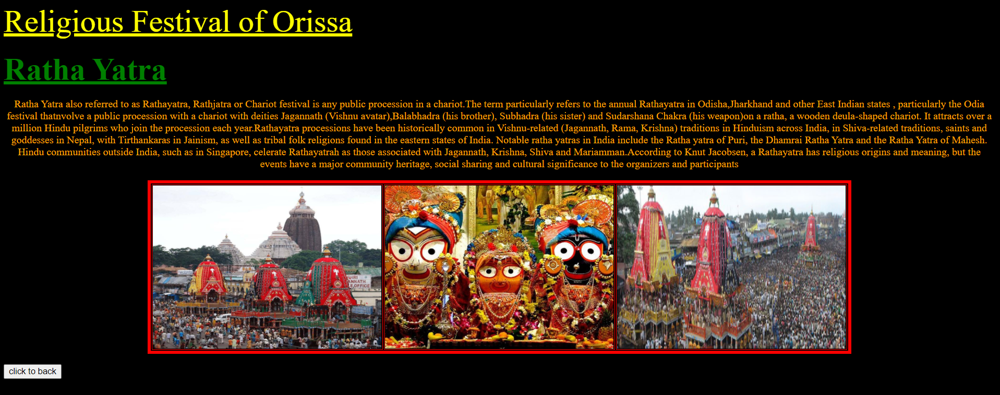
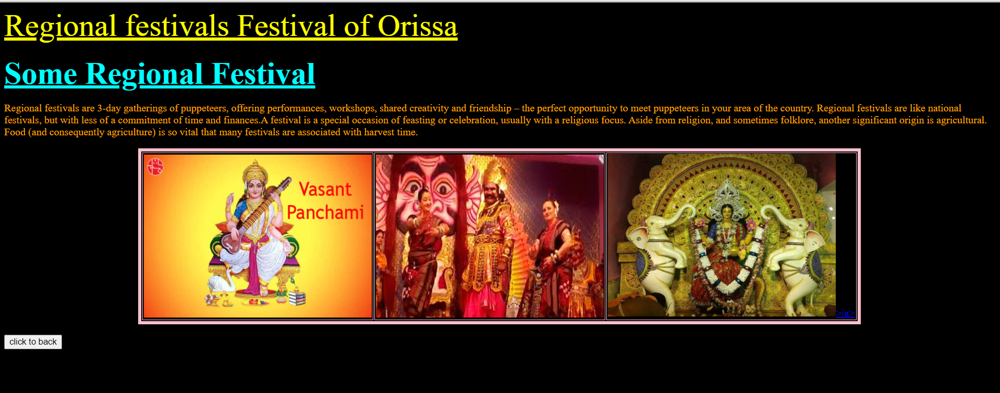
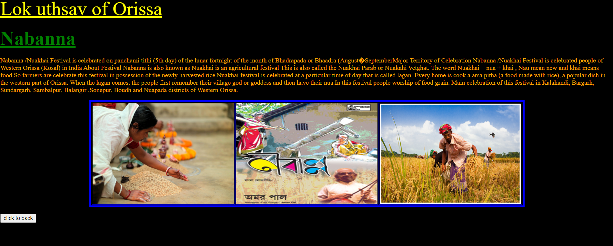
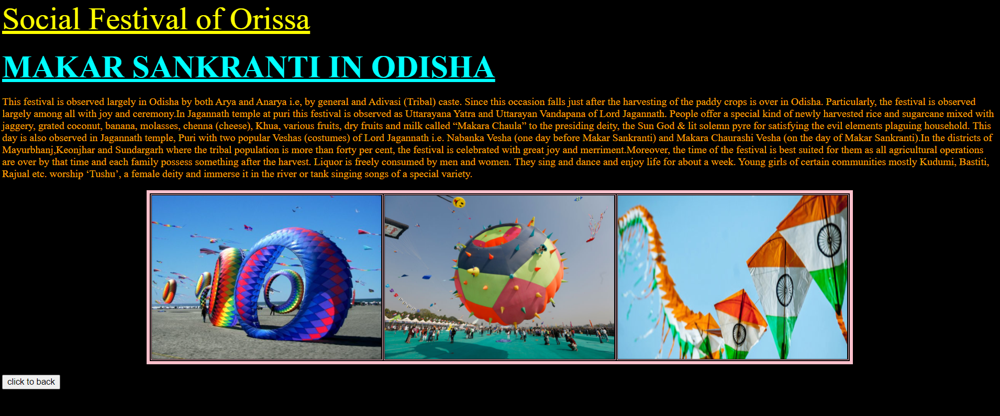

***This new Website based on Odissa' Festivals is created by Ankita Sikder, student of BTECH, in University of Engineering and Management, Kolkata.***

**Email Id: ankita.sikder14@gmail.com** 

# ODISHA-FESTIVALS :star_struck: :family: :man: :woman: :sunny:

 

## About :point_down: 

     
Odisha Odia: , formerly Orissa, is the 8th largest state by area, and the 11th largest by population. The state has the third largest population of Scheduled Tribes in India. It neighbours the states of West Bengal and Jharkhand to the north, Chhattisgarh to the west, and Andhra Pradesh to the south. Odisha has a coastline of 485 kilometres (301 mi) along the Bay of Bengal. The region is also known as Utkala and is mentioned in India's national anthem, "Jana Gana Mana". The language of Odisha is Odia, which is one of the Classical Languages of India.
The ancient kingdom of Kalinga, which was invaded by the Mauryan emperor Ashoka (which was again won back from them by king Kharavela) in 261 BCE resulting in the Kalinga War, coincides with the borders of modern-day Odisha. The modern boundaries of Odisha were demarcated by the British Indian government when Orissa Province was established on 1 April 1936, consisting of the Odia-speaking districts of Bihar and Orissa Province. The first of April is celebrated as Utkala Dibasa. Cuttack was made the capital of the region by Anantavarman Chodaganga in c. 1135, after which the city was used as the capital by many rulers, through the British era until 1948. Thereafter, Bhubaneswar became the capital of Odisha. 
This is a website created by HTML only. Here are total five parts and introduction part. First is Religious Festival. Here we can know about Ratha Yatra. The second part, Social Festival contains description about Makar Sankranti. In the third part, Regional Festival part, we can find Vasanta Panchami, Dhanu Jatra, Gajalaxmi Puja, Raja Parba. In the fourth part, we can learn about Nabanna ,Lok Uthsav of Odisha. In the last part ,Developers Introduction, contains six names but the project is only developed by Biswarup Bhattacharjee. The other names are included just for project submission for HS exam. In this website we can easily learn about Odisha's festivals instead of searching them in other fields. The designs and divisions are made to make it user friendly. People just has to click on left menu in home page to open religious festival, social festival, regional festival, lok utsav, developers section. I have made this website with HTML5 only. For references for Orisha and Orisha's festivals I have used *[wikipedia](https://en.wikipedia.org/wiki/Festivals_of_Odisha)*.

## LINK of full project: :point_right: https://ankitasikder.github.io/ODISSA-FESTIVALS/. 

## Why I have made this project :point_down:

     
Festivals are a big part of Indian culture and tradition. The same is the case with Odisha. While many people often tend to think that Odisha is only about Rathyatra, the state does celebrate a lot more than just that. It is best if you know what they are and what kind of things are done during those festivals if you do want a one of a kind experience. You must ensure the kind of significance they have and the kind of influence they have on the culture and traditions of the people involved. To help you gain a better understanding and knowledge of the festivals in Odisha, I have made this website. To know about Orisha's culture, festivals it is important and user friendly.

## Screenshots of the website :point_down: 

  

 

